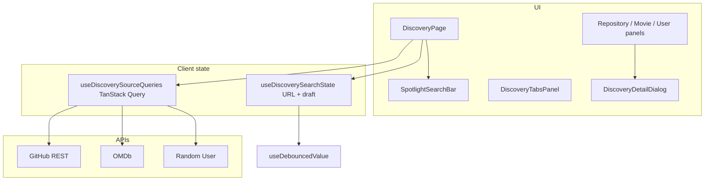

# Tabs-Based Search & Discovery — Implementation Guide (This Codebase)

This document maps the **Frontend Intern Assignment** requirements to **this repository’s implementation**, with **verbatim code citations** from the codebase. Use it to prepare for technical interviews: architecture, trade-offs, and “where is X implemented?” questions.

---

## 1. Assignment vs. this project (important caveat)

| Assignment | This codebase |
|------------|----------------|
| **TMDB** for movies | **OMDb** (Open Movie Database) via `searchMovies` / `fetchMovieByImdbId` — still satisfies “movie search + poster + metadata,” but a different API. |
| GitHub + optional Random User | **GitHub REST** + **Random User** + **OMDb** (three sources). |
| Next.js optional | **React SPA** with **Vite-style** entry (`frontend.tsx`) and **Bun** as the dev server and bundler. |

If an interviewer asks about TMDB: you can explain you integrated **OMDb** instead (search + detail fetch, poster in list, full plot in modal), with environment-based configuration.

---

## 2. Tech stack (from the repo)

Key dependencies and tooling:

```1:33:/home/tejas-prasad/My-Projects/Discover/package.json
{
  "name": "bun-react-template",
  "version": "0.1.0",
  "private": true,
  "type": "module",
  "scripts": {
    "dev": "bun --hot src/index.ts",
    "build": "bun build ./src/index.html --outdir=dist --sourcemap --target=browser --minify --define:process.env.NODE_ENV='\"production\"' --env='BUN_PUBLIC_*'",
    "start": "NODE_ENV=production bun src/index.ts"
  },
  "dependencies": {
    "@radix-ui/react-tabs": "^1.1.13",
    "@tanstack/react-query": "^5.97.0",
    ...
    "react": "^19",
    "react-dom": "^19",
    "react-router-dom": "^7.14.0",
    ...
    "zod": "^4.3.6"
  },
  ...
}
```

- **React 19** + **TypeScript** + **functional components / hooks** (per assignment).
- **TanStack Query** for server state, caching, and infinite pagination.
- **React Router** for URL search params (`?q=`, `?tab=`).
- **Tailwind CSS** + **shadcn-style UI** (`src/components/ui/*`) for layout and accessible primitives.
- **Bun** for `dev`, `build`, and `start`.

---

## 3. High-level architecture



**Composition root:** `App` wires providers and a single page.

```1:12:/home/tejas-prasad/My-Projects/Discover/src/App.tsx
import { DiscoveryPage } from "@/features/discovery/DiscoveryPage";
import { AppProviders } from "@/providers/AppProviders";

export function App() {
  return (
    <AppProviders>
      <DiscoveryPage />
    </AppProviders>
  );
}

export default App;
```

**Providers:** React Query + browser router.

```1:19:/home/tejas-prasad/My-Projects/Discover/src/providers/AppProviders.tsx
import { QueryClientProvider } from "@tanstack/react-query";
import { useState, type ReactNode } from "react";
import { BrowserRouter } from "react-router-dom";

import { createAppQueryClient } from "@/lib/query-client";

type AppProvidersProps = {
  children: ReactNode;
};

export function AppProviders({ children }: AppProvidersProps) {
  const [queryClient] = useState(() => createAppQueryClient());

  return (
    <QueryClientProvider client={queryClient}>
      <BrowserRouter>{children}</BrowserRouter>
    </QueryClientProvider>
  );
}
```

---

## 4. Requirement checklist (mapped to code)

### 4.1 Single global search driving all categories

`DiscoveryPage` holds one search field (`draft`) and one **committed** query from the URL (`committedQuery`). All three sources use `committedQuery`:

```16:38:/home/tejas-prasad/My-Projects/Discover/src/features/discovery/DiscoveryPage.tsx
export function DiscoveryPage() {
  const searchInputRef = useRef<HTMLInputElement>(null);
  useSpotlightFocusShortcut(searchInputRef);

  const [detailSelection, setDetailSelection] = useState<DiscoveryDetailSelection | null>(null);

  const {
    draft,
    setDraft,
    committedQuery,
    tab,
    setTab,
    commitSearchNow,
  } = useDiscoverySearchState();

  const hasQuery = committedQuery.length > 0;
  const queries = useDiscoverySourceQueries(committedQuery);

  const searchBusy =
    hasQuery &&
    (queries.repositories.isPending ||
      queries.movies.isPending ||
      queries.users.isPending);
```

The spotlight field binds `draft` / `setDraft` and **Enter flushes** via `commitSearchNow` (see debouncing section).

### 4.2 Tabs per data source + clear active state

Tab values are typed and synced with `?tab=`:

```1:4:/home/tejas-prasad/My-Projects/Discover/src/types/index.ts
/** URL / UI tab identifiers for discovery (kept in sync with `?tab=`). */
export const DISCOVERY_TAB_VALUES = ["repositories", "movies", "users"] as const;
export type DiscoveryTab = (typeof DISCOVERY_TAB_VALUES)[number];
export const DEFAULT_DISCOVERY_TAB: DiscoveryTab = "repositories";
```

`DiscoveryTabsPanel` wraps Radix tabs; content is injected as props (presentation vs. data).

```33:76:/home/tejas-prasad/My-Projects/Discover/src/features/discovery/components/DiscoveryTabsPanel.tsx
  return (
    <Tabs
      value={activeTab}
      onValueChange={(v) => onTabChange(v as DiscoveryTab)}
      className={cn("flex w-full flex-col gap-6", className)}
      aria-label="Discovery sources"
    >
      <TabsList
        variant="line"
        className="mx-auto flex h-auto w-full max-w-2xl flex-wrap justify-center gap-0 border-b border-border bg-transparent p-0"
      >
        <TabsTrigger
          value="repositories"
          className="min-w-0 flex-1 rounded-none border-0 border-b-2 border-transparent px-3 py-3 data-active:border-primary data-active:bg-transparent sm:flex-none sm:px-6"
        >
          <GitBranch className="size-4" aria-hidden />
          <span className="ml-1.5">Repositories</span>
        </TabsTrigger>
        ...
      </TabsList>

      <TabsContent value="repositories" className="mt-0 outline-none">
        {repositoriesPanel}
      </TabsContent>
      ...
    </Tabs>
  );
```

### 4.3 Data persists when switching tabs (no unnecessary refetch)

Three separate `useInfiniteQuery` hooks share the same `committedQuery` but have **distinct query keys**. TanStack Query keeps cached **pages** in memory; switching tabs **does not unmount the query hooks** from `DiscoveryPage`—only the visible panel changes—so previously fetched data remains available.

Query keys (per source + query string):

```1:8:/home/tejas-prasad/My-Projects/Discover/src/lib/query-keys.ts
/** Stable TanStack Query keys for discovery sources (per PRD: cache per tab + query). */
export const discoveryKeys = {
  all: ["discovery"] as const,
  repositories: (query: string) =>
    [...discoveryKeys.all, "repositories", query] as const,
  movies: (query: string) => [...discoveryKeys.all, "movies", query] as const,
  users: (query: string) => [...discoveryKeys.all, "users", query] as const,
};
```

Global query defaults reduce noisy refetches:

```1:14:/home/tejas-prasad/My-Projects/Discover/src/lib/query-client.ts
import { QueryClient } from "@tanstack/react-query";

export function createAppQueryClient() {
  return new QueryClient({
    defaultOptions: {
      queries: {
        staleTime: 1000 * 60 * 5,
        gcTime: 1000 * 60 * 30,
        retry: 1,
        refetchOnWindowFocus: false,
      },
    },
  });
}
```

All three sources are wired with `enabled: committedQuery.trim().length > 0` so **empty search** does not hit APIs:

```16:34:/home/tejas-prasad/My-Projects/Discover/src/hooks/useDiscoverySourceQueries.ts
export function useDiscoverySourceQueries(committedQuery: string) {
  const enabled = committedQuery.trim().length > 0;

  const repositories = useInfiniteQuery({
    queryKey: discoveryKeys.repositories(committedQuery),
    queryFn: ({ pageParam }) =>
      searchRepositories(committedQuery, pageParam, GITHUB_PER_PAGE),
    initialPageParam: 1,
    getNextPageParam: (lastPage, allPages) => {
      if (lastPage.repositories.length < GITHUB_PER_PAGE) return undefined;
      const loaded = allPages.reduce(
        (sum, p) => sum + p.repositories.length,
        0,
      );
      if (loaded >= lastPage.totalCount) return undefined;
      return allPages.length + 1;
    },
    enabled,
  });
```

### 4.4 API integration (at least two) + normalization

**GitHub:** maps API JSON to a typed `Repository` shape (stars, forks, description, etc.):

```57:78:/home/tejas-prasad/My-Projects/Discover/src/services/github.ts
  const repositories: Repository[] = items.map((item) => ({
    id: item.id,
    source: "repository",
    title: item.full_name,
    description: item.description ?? "No description",
    owner: item.owner.login,
    stars: item.stargazers_count,
    forks: item.forks_count,
    language: item.language ?? undefined,
    url: item.html_url,
    avatarUrl: item.owner.avatar_url,
    imageUrl: item.owner.avatar_url,
    metadata: {
      fullName: item.full_name,
      language: item.language,
    },
  }));

  return {
    repositories,
    totalCount: data.total_count ?? repositories.length,
  };
```

**OMDb:** search + optional detail by IMDb id for the modal.

```23:81:/home/tejas-prasad/My-Projects/Discover/src/services/omdb.ts
export async function searchMovies(
  query: string,
  page: number = 1,
): Promise<{ movies: Movie[]; totalCount: number }> {
  if (!query.trim()) {
    throw new Error("Search query cannot be empty");
  }

  const params = new URLSearchParams({
    apikey: getOmdbApiKey(),
    s: query.trim(),
    page: String(page),
    type: "movie",
  });

  const response = await fetch(`${getOmdbEndpoint()}/?${params}`);
  ...
  const movies: Movie[] = data.Search.map((item) => {
    const posterOk = item.Poster && item.Poster !== "N/A";
    return {
      id: item.imdbID,
      source: "movie",
      title: item.Title,
      ...
      posterPath: posterOk ? item.Poster : undefined,
      imageUrl: posterOk ? item.Poster : undefined,
      ...
    };
  });

  return {
    movies,
    totalCount: Number.isFinite(total) ? total : movies.length,
  };
}
```

**Random User:** documented limitation — no text search; **batch fetch + client-side name filter** to preserve “search-like” UX:

```40:44:/home/tejas-prasad/My-Projects/Discover/src/services/random-user.ts
/**
 * Random User Generator has no text search. We fetch a batch and filter by name
 * so the UX still feels like “search” (PRD optional users source).
 * `page` maps to the API `page` param for load-more batches.
 */
```

### 4.5 Detail view (modal)

`DiscoveryDetailDialog` uses a **discriminated union** `DiscoveryDetailSelection` and renders per source. Movies trigger a **second request** for full plot/ratings via `fetchMovieByImdbId`.

```23:61:/home/tejas-prasad/My-Projects/Discover/src/features/discovery/components/DiscoveryDetailDialog.tsx
export function DiscoveryDetailDialog({ selection, onClose }: DiscoveryDetailDialogProps) {
  const open = selection !== null;

  const imdbID =
    selection?.source === "movie" ? String(selection.item.id) : "";

  const detailQuery = useQuery({
    queryKey: movieDetailKey(imdbID),
    queryFn: () => fetchMovieByImdbId(imdbID),
    enabled: open && selection?.source === "movie" && imdbID.length > 0,
  });

  return (
    <Dialog
      open={open}
      onOpenChange={(next) => {
        if (!next) onClose();
      }}
    >
      <DialogContent
        showCloseButton
        className="max-h-[min(90dvh,720px)] max-w-[calc(100vw-1.5rem)] gap-0 overflow-y-auto p-0 sm:max-w-lg md:max-w-xl"
      >
        {selection?.source === "repository" ? (
          <RepositoryDetailBody item={selection.item} onClose={onClose} />
        ) : null}
        {selection?.source === "movie" ? (
          <MovieDetailBody
            item={selection.item}
            query={detailQuery}
            onClose={onClose}
          />
        ) : null}
        ...
      </DialogContent>
    </Dialog>
  );
}
```

### 4.6 Loading / error / empty states

- **Loading:** skeleton grids in each results panel (see repository panel example below).
- **Error + retry:** shared `DiscoveryQueryErrorAlert`.

```6:26:/home/tejas-prasad/My-Projects/Discover/src/features/discovery/components/DiscoveryQueryErrorAlert.tsx
export function DiscoveryQueryErrorAlert({
  title,
  message,
  onRetry,
}: {
  title: string;
  message: string;
  onRetry: () => void;
}) {
  return (
    <Alert variant="destructive" role="alert">
      <AlertCircle className="size-4" />
      <AlertTitle>{title}</AlertTitle>
      <AlertDescription className="flex flex-col gap-3 sm:flex-row sm:items-center sm:justify-between">
        <span>{message}</span>
        <Button type="button" variant="outline" size="sm" onClick={onRetry}>
          Retry
        </Button>
      </AlertDescription>
    </Alert>
  );
}
```

- **Idle (no query yet):** `DiscoveryPlaceholderPanel` explains URL sync and tab caching.

### 4.7 Debounced search (expected)

**Core primitive:** `useDebouncedValue` — value updates only after it stops changing for `delayMs`.

```1:16:/home/tejas-prasad/My-Projects/Discover/src/hooks/useDebouncedValue.ts
import { useEffect, useState } from "react";

/**
 * Returns `value` after it has stayed stable for `delayMs`.
 * Useful for debouncing URL updates and network requests driven by text input.
 */
export function useDebouncedValue<T>(value: T, delayMs: number): T {
  const [debounced, setDebounced] = useState(value);

  useEffect(() => {
    const id = globalThis.setTimeout(() => setDebounced(value), delayMs);
    return () => globalThis.clearTimeout(id);
  }, [value, delayMs]);

  return debounced;
}
```

**Wiring:** `useDiscoverySearchState` debounces **URL updates** (350ms). The **committed query** in the URL is what drives fetching, so API calls are debounced indirectly.

```8:39:/home/tejas-prasad/My-Projects/Discover/src/hooks/useDiscoverySearchState.ts
const QUERY_DEBOUNCE_MS = 350;

export function useDiscoverySearchState() {
  const [searchParams, setSearchParams] = useSearchParams();

  const { q: committedQuery, tab } = useMemo(
    () => parseDiscoveryState(searchParams),
    [searchParams],
  );

  const [draft, setDraft] = useState(committedQuery);

  useEffect(() => {
    setDraft(committedQuery);
  }, [committedQuery]);

  const debouncedDraft = useDebouncedValue(draft, QUERY_DEBOUNCE_MS);

  useEffect(() => {
    const next = debouncedDraft.trim();
    if (next === committedQuery) return;
    setSearchParams(
      (prev) => applyDiscoveryQuery(prev, { q: debouncedDraft }),
      { replace: true },
    );
  }, [debouncedDraft, committedQuery, setSearchParams]);

  const commitSearchNow = useCallback(() => {
    setSearchParams((prev) => applyDiscoveryQuery(prev, { q: draft }), {
      replace: true,
    });
  }, [draft, setSearchParams]);
```

**Immediate search:** `commitSearchNow` is passed to the spotlight bar so **Enter** commits without waiting for debounce.

### 4.8 URL state (`?q=` + optional `?tab=`)

Parsing and patching helpers keep invalid tabs from breaking the app and preserve unrelated query keys:

```11:48:/home/tejas-prasad/My-Projects/Discover/src/lib/discovery-url.ts
export function parseDiscoveryTab(raw: string | null): DiscoveryTab {
  const r = tabSchema.safeParse(raw ?? "");
  return r.success ? r.data : DEFAULT_DISCOVERY_TAB;
}
...
export function applyDiscoveryQuery(
  prev: URLSearchParams,
  patch: { q?: string; tab?: DiscoveryTab },
): URLSearchParams {
  const next = new URLSearchParams(prev);

  if (patch.q !== undefined) {
    const trimmed = patch.q.trim();
    if (trimmed) next.set("q", trimmed);
    else next.delete("q");
  }

  if (patch.tab !== undefined) {
    if (patch.tab === DEFAULT_DISCOVERY_TAB) next.delete("tab");
    else next.set("tab", patch.tab);
  }

  return next;
}
```

### 4.9 Pagination / load more

Each source uses `useInfiniteQuery` with `getNextPageParam` (see `useDiscoverySourceQueries.ts` earlier). UI uses a shared `DiscoveryLoadMoreButton` in the results panels (load more repositories/movies/users).

### 4.10 Environment variables (public config)

`.env.example` documents `BUN_PUBLIC_*` variables (inlined at build time for the browser bundle per `package.json` `build` script).

```1:15:/home/tejas-prasad/My-Projects/Discover/.env.example
# Copy to `.env` and fill in. Only `BUN_PUBLIC_*` keys are exposed to the browser bundle.
# Never commit `.env` or real tokens (already gitignored).

# GitHub REST search 
BUN_PUBLIC_GITHUB_ENDPOINT=https://api.github.com/search/repositories

# Optional: increases rate limits. Create a fine-grained or classic PAT in GitHub settings.
BUN_PUBLIC_GITHUB_PAT=

# OMDB (Open Movie Database) — https://www.omdbapi.com/apikey.aspx
BUN_PUBLIC_OMDB_ENDPOINT=https://www.omdbapi.com
BUN_PUBLIC_OMDB_API_KEY=

# Random User API 
BUN_PUBLIC_RANDOM_USER_API=https://randomuser.me/api
```

---

## 5. Interview Q&A (with code-backed answers)

### Why React (and not Next.js here)?

This deliverable is a **client-rendered SPA**: one HTML shell (`src/index.html`) loads `frontend.tsx`, and routing is **client-side** via `BrowserRouter`. Next.js would add SSR/SSG and a different deployment model; the assignment only requires React. The app composes a single feature page under `App`:

```4:8:/home/tejas-prasad/My-Projects/Discover/src/App.tsx
export function App() {
  return (
    <AppProviders>
      <DiscoveryPage />
    </AppProviders>
  );
}
```

### Why TanStack Query?

It centralizes **server state**: caching, deduplication, retries, and infinite pagination. The app wraps the tree in `QueryClientProvider` and uses `useInfiniteQuery` / `useQuery` for lists and movie details.

```11:18:/home/tejas-prasad/My-Projects/Discover/src/providers/AppProviders.tsx
export function AppProviders({ children }: AppProvidersProps) {
  const [queryClient] = useState(() => createAppQueryClient());

  return (
    <QueryClientProvider client={queryClient}>
      <BrowserRouter>{children}</BrowserRouter>
    </QueryClientProvider>
  );
}
```

### Where is debouncing implemented?

In **`useDebouncedValue`** and **`useDiscoverySearchState`** (350ms), cited in sections **4.7** above.

### Where does Enter / submit trigger search?

The spotlight search is a `<form onSubmit={handleSubmit}>` that calls `onSubmitSearch` → `commitSearchNow` (immediate URL update). See `DiscoveryPage` wiring:

```66:72:/home/tejas-prasad/My-Projects/Discover/src/features/discovery/DiscoveryPage.tsx
              <div className="mt-10 w-full">
                <SpotlightSearchBar
                  ref={searchInputRef}
                  value={draft}
                  onValueChange={setDraft}
                  onSubmitSearch={commitSearchNow}
                  isBusy={searchBusy}
                />
```

### How do you avoid refetching on every keystroke?

1. Debounced updates to `q` in the URL (`useDebouncedValue` + effect in `useDiscoverySearchState`).
2. TanStack Query keys include the **committed** query string; until `q` changes, the same cached data is reused.

### How does one tab failing not break others?

Each source is a **separate** `useInfiniteQuery`. Errors are handled **inside** that tab’s panel via `DiscoveryQueryErrorAlert` and `refetch()` for that query only—other queries keep their own status.

### How is “load more” implemented?

`useInfiniteQuery` + `fetchNextPage` from TanStack Query, with `getNextPageParam` defined per API in `useDiscoverySourceQueries.ts` (full file cited in **4.3**).

### What shared / reusable UI exists?

- **Tabs:** `DiscoveryTabsPanel` + `components/ui/tabs`.
- **Cards:** e.g. `RepositoryCard` uses shared `Card` primitives and shows stars/forks/description:

```13:46:/home/tejas-prasad/My-Projects/Discover/src/features/repositories/components/RepositoryCard.tsx
export function RepositoryCard({ repository, onSelect, className }: RepositoryCardProps) {
  return (
    <button
      type="button"
      onClick={onSelect}
      className={cn(
        "w-full min-w-0 rounded-xl text-left transition-shadow hover:shadow-md focus-visible:outline-none focus-visible:ring-2 focus-visible:ring-ring focus-visible:ring-offset-2 ring-offset-background",
        className,
      )}
    >
      <Card size="sm" className="h-full shadow-none">
        <CardHeader className="gap-1 pb-2">
          <CardTitle className="line-clamp-2 text-base leading-snug text-primary">
            {repository.title}
          </CardTitle>
          <p className="text-xs text-muted-foreground">{repository.owner}</p>
        </CardHeader>
        <CardContent className="space-y-3 pt-0">
          <p className="line-clamp-3 text-muted-foreground">{repository.description}</p>
          <div className="flex flex-wrap gap-3 text-xs text-muted-foreground">
            <span className="inline-flex items-center gap-1">
              <Star className="size-3.5 shrink-0 text-amber-500" aria-hidden />
              {repository.stars.toLocaleString()}
            </span>
            <span className="inline-flex items-center gap-1">
              <GitFork className="size-3.5 shrink-0" aria-hidden />
              {repository.forks.toLocaleString()}
            </span>
```

- **Cross-cutting panel chrome:** `DiscoveryQueryErrorAlert`, `DiscoveryLoadMoreButton`, `DiscoveryPlaceholderPanel`.

### Any keyboard / accessibility extras?

`useSpotlightFocusShortcut` focuses the search input on **⌘K / Ctrl+K**:

```1:27:/home/tejas-prasad/My-Projects/Discover/src/hooks/useSpotlightFocusShortcut.ts
/**
 * Focus the spotlight field on ⌘K / Ctrl+K (common command-palette pattern, matches Spotlight muscle memory).
 */
export function useSpotlightFocusShortcut(
  targetRef: RefObject<HTMLElement | null>,
  enabled = true,
) {
  useEffect(() => {
    if (!enabled) return;

    const onKeyDown = (e: KeyboardEvent) => {
      if (!e.key || e.key.toLowerCase() !== "k") return;
      if (!(e.metaKey || e.ctrlKey)) return;
      if (e.altKey || e.shiftKey) return;

      const el = targetRef.current;
      if (!el) return;

      e.preventDefault();
      el.focus({ preventScroll: false });
    };

    window.addEventListener("keydown", onKeyDown);
    return () => window.removeEventListener("keydown", onKeyDown);
  }, [enabled, targetRef]);
}
```

### Why Bun?

The project scripts use **Bun** for dev (HMR), production bundling of `index.html`, and running the server (`package.json` **lines 6–9** in section **2**). This is a tooling choice aligned with the repo scaffold; the React patterns are standard.

### Are there unit tests?

There is **no `*.test.*` suite** in the tree at the time of this guide. The assignment lists tests as **bonus**; you can honestly say TanStack Query + typed services + URL helpers are structured to be testable, but automated tests are not yet present.

---

## 6. Folder structure (mental model)

- `src/features/discovery/` — page shell, tabs, result panels, detail dialog.
- `src/features/{repositories,movies,users}/components/` — source-specific cards.
- `src/services/` — `fetch` wrappers and DTO → domain mapping.
- `src/hooks/` — debounce, URL state, data hooks, keyboard shortcut.
- `src/lib/` — query client, query keys, URL helpers.
- `src/components/ui/` — shadcn-style primitives (Button, Tabs, Dialog, Skeleton, …).

---

## 7. Quick “demo script” for interview walkthrough

1. Show **URL** updating (`?q=` / `?tab=`) via `useDiscoverySearchState` + `discovery-url.ts`.
2. Type fast → explain **debounce** (`useDebouncedValue`).
3. Press **Enter** → `commitSearchNow` updates URL immediately.
4. Open **Network** tab → one set of requests per committed query; switch tabs → **no duplicate** fetches if data is fresh (TanStack cache + `staleTime`).
5. Break **one API key** → only that tab shows `DiscoveryQueryErrorAlert`; others still work.
6. Open a **movie** → second fetch in modal (`fetchMovieByImdbId`).

---

## 8. Curated interview Q&A (from this codebase)

The questions below are answered **only** from how this repository is built. Snippets cite the actual files.

### 1. How is the global search implemented such that one search bar queries through three APIs?

There is **one** controlled input (`draft`) and **one** canonical query string taken from the URL (`committedQuery`). The page passes that single `committedQuery` into `useDiscoverySourceQueries`, which creates **three independent** `useInfiniteQuery` hooks—one per API (GitHub, OMDb, Random User). All three read the same string; each hook has its own `queryKey` and `queryFn`, so the three networks run in parallel when `enabled` is true.

```22:32:/home/tejas-prasad/My-Projects/Discover/src/features/discovery/DiscoveryPage.tsx
  const {
    draft,
    setDraft,
    committedQuery,
    tab,
    setTab,
    commitSearchNow,
  } = useDiscoverySearchState();

  const hasQuery = committedQuery.length > 0;
  const queries = useDiscoverySourceQueries(committedQuery);
```

```16:34:/home/tejas-prasad/My-Projects/Discover/src/hooks/useDiscoverySourceQueries.ts
export function useDiscoverySourceQueries(committedQuery: string) {
  const enabled = committedQuery.trim().length > 0;

  const repositories = useInfiniteQuery({
    queryKey: discoveryKeys.repositories(committedQuery),
    queryFn: ({ pageParam }) =>
      searchRepositories(committedQuery, pageParam, GITHUB_PER_PAGE),
    initialPageParam: 1,
    getNextPageParam: (lastPage, allPages) => {
      if (lastPage.repositories.length < GITHUB_PER_PAGE) return undefined;
      ...
    },
    enabled,
  });
```

The search bar itself does not call APIs; it updates `draft` and (debounced or on submit) updates `?q=` in the URL, which updates `committedQuery` and thus what TanStack Query fetches.

---

### 2. How is the data stored “in the tab”?

Data is **not** stored in React component state per tab. It lives in the **TanStack Query client cache** in memory, keyed by **source + committed query string** (`discoveryKeys.*`). The three infinite queries stay mounted under `DiscoveryPage`, so when you switch UI tabs you are only changing which `TabsContent` is visible—the cached **pages** for each source remain in the query client until garbage-collected (`gcTime`) or the query key changes (new `q`).

```1:8:/home/tejas-prasad/My-Projects/Discover/src/lib/query-keys.ts
/** Stable TanStack Query keys for discovery sources (per PRD: cache per tab + query). */
export const discoveryKeys = {
  all: ["discovery"] as const,
  repositories: (query: string) =>
    [...discoveryKeys.all, "repositories", query] as const,
  movies: (query: string) => [...discoveryKeys.all, "movies", query] as const,
  users: (query: string) => [...discoveryKeys.all, "users", query] as const,
};
```

```3:13:/home/tejas-prasad/My-Projects/Discover/src/lib/query-client.ts
export function createAppQueryClient() {
  return new QueryClient({
    defaultOptions: {
      queries: {
        staleTime: 1000 * 60 * 5,
        gcTime: 1000 * 60 * 30,
        retry: 1,
        refetchOnWindowFocus: false,
      },
    },
  });
}
```

The **UI tabs** (`DiscoveryTabsPanel`) only control which panel component is shown; they do not own the fetched data.

---

### 3. How is React Router used to store the persistent URL?

`BrowserRouter` wraps the app. `useDiscoverySearchState` uses **`useSearchParams`** from `react-router-dom` to read and write **`q`** (search query) and **`tab`** (active discovery tab). Helpers in `discovery-url.ts` parse and patch `URLSearchParams` so invalid `tab` values fall back to the default and unrelated query keys are preserved.

```10:47:/home/tejas-prasad/My-Projects/Discover/src/hooks/useDiscoverySearchState.ts
export function useDiscoverySearchState() {
  const [searchParams, setSearchParams] = useSearchParams();

  const { q: committedQuery, tab } = useMemo(
    () => parseDiscoveryState(searchParams),
    [searchParams],
  );
  ...
  const setTab = useCallback(
    (nextTab: DiscoveryTab) => {
      setSearchParams((prev) => applyDiscoveryQuery(prev, { tab: nextTab }), {
        replace: true,
      });
    },
    [setSearchParams],
  );
```

```16:27:/home/tejas-prasad/My-Projects/Discover/src/lib/discovery-url.ts
export function parseCommittedQuery(searchParams: URLSearchParams): string {
  return (searchParams.get("q") ?? "").trim();
}

export function parseDiscoveryState(searchParams: URLSearchParams): {
  q: string;
  tab: DiscoveryTab;
} {
  return {
    q: parseCommittedQuery(searchParams),
    tab: parseDiscoveryTab(searchParams.get("tab")),
  };
}
```

Using `replace: true` avoids cluttering history on every keystroke-driven URL update (debounced path).

---

### 4. Where are the interfaces written for the API response?

**Normalized domain types** and **shared result shapes** live in `src/types/index.ts` (`SearchResult`, `Repository`, `Movie`, `User`, `DiscoveryDetailSelection`, etc.). **Raw API payload types** used when parsing JSON are also declared there—for example `GitHubSearchResponse` and `OmdbSearchResponse`.

```6:79:/home/tejas-prasad/My-Projects/Discover/src/types/index.ts
/** Shared result shape across discovery sources */
export interface SearchResult {
  id: string | number;
  source: "repository" | "movie" | "user";
  title: string;
  description: string;
  imageUrl?: string;
  url?: string;
  metadata: Record<string, unknown>;
}

export interface Repository extends SearchResult {
  source: "repository";
  owner: string;
  stars: number;
  forks: number;
  language?: string;
  url: string;
  avatarUrl: string;
}
...
export interface GitHubSearchResponse {
  items: Array<{
    id: number;
    full_name: string;
    ...
  }>;
  total_count: number;
}

/** Raw OMDB search payload (`s=`). */
export interface OmdbSearchResponse {
  Search?: Array<{
    Title: string;
    Year: string;
    imdbID: string;
    ...
  }>;
  ...
}
```

Service modules (`src/services/github.ts`, `omdb.ts`, `random-user.ts`) **import** these types and map API JSON into `Repository` / `Movie` / `User`. Additional response-only types (e.g. `OmdbMovieDetail` for the `i=` detail call) are colocated in `omdb.ts` where they are used.

---

### 5. What is the delay of debounce?

**350 ms**, via `QUERY_DEBOUNCE_MS` in `useDiscoverySearchState`, passed into `useDebouncedValue(draft, QUERY_DEBOUNCE_MS)`.

```8:24:/home/tejas-prasad/My-Projects/Discover/src/hooks/useDiscoverySearchState.ts
const QUERY_DEBOUNCE_MS = 350;

export function useDiscoverySearchState() {
  ...
  const debouncedDraft = useDebouncedValue(draft, QUERY_DEBOUNCE_MS);
```

---

### 6. Why React over Next.js?

This app is a **single-page application**: one HTML entry loads the React tree and client-side routing handles URL state. There is **no** Next.js `app/` or `pages/` router, no RSC, and no framework-specific data fetching on the server. `App` only composes providers and `DiscoveryPage`.

```1:12:/home/tejas-prasad/My-Projects/Discover/src/App.tsx
import { DiscoveryPage } from "@/features/discovery/DiscoveryPage";
import { AppProviders } from "@/providers/AppProviders";

export function App() {
  return (
    <AppProviders>
      <DiscoveryPage />
    </AppProviders>
  );
}
```

You can justify this in an interview: the assignment requires React + client hooks and public APIs; a lightweight SPA with React Router and TanStack Query meets the brief without SSR complexity.

---

### 7. Why Bun + React and not React + Vite?

This repository is scaffolded around **Bun** as the runtime and bundler: `dev` uses `bun --hot src/index.ts`, and `build` uses `bun build ./src/index.html`. There is **no** `vite.config` in the project—tooling is Bun-native end-to-end.

```6:9:/home/tejas-prasad/My-Projects/Discover/package.json
  "scripts": {
    "dev": "bun --hot src/index.ts",
    "build": "bun build ./src/index.html --outdir=dist --sourcemap --target=browser --minify --define:process.env.NODE_ENV='\"production\"' --env='BUN_PUBLIC_*'",
    "start": "NODE_ENV=production bun src/index.ts"
  },
```

React components are standard; only the **toolchain** differs from a Vite template.

---

### 8. Why TanStack Query and what does it do?

It manages **server/async state**: caching, deduplication, retries, and pagination. The app wraps the tree in `QueryClientProvider` with `createAppQueryClient()`. List data uses **`useInfiniteQuery`** (pages + “load more”); movie details in the modal use **`useQuery`**. That avoids hand-rolling cache maps and loading flags in React state.

```11:18:/home/tejas-prasad/My-Projects/Discover/src/providers/AppProviders.tsx
export function AppProviders({ children }: AppProvidersProps) {
  const [queryClient] = useState(() => createAppQueryClient());

  return (
    <QueryClientProvider client={queryClient}>
      <BrowserRouter>{children}</BrowserRouter>
    </QueryClientProvider>
  );
}
```

```19:34:/home/tejas-prasad/My-Projects/Discover/src/hooks/useDiscoverySourceQueries.ts
  const repositories = useInfiniteQuery({
    queryKey: discoveryKeys.repositories(committedQuery),
    queryFn: ({ pageParam }) =>
      searchRepositories(committedQuery, pageParam, GITHUB_PER_PAGE),
    ...
    enabled,
  });
```

---

### 9. How is opening an individual result in a new tab vs. a modal handled?

In **this codebase**, results open in a **modal dialog** (`Dialog` from `@/components/ui/dialog`), not a new browser tab or route. `DiscoveryPage` keeps `detailSelection` in React state; clicking a card sets that state; `DiscoveryDetailDialog` reads it and renders repository / movie / user bodies inside `DialogContent`. There is **no** `target="_blank"` navigation for the primary “open detail” action—external links (e.g. GitHub) are separate buttons inside the modal.

```20:61:/home/tejas-prasad/My-Projects/Discover/src/features/discovery/components/DiscoveryDetailDialog.tsx
export function DiscoveryDetailDialog({ selection, onClose }: DiscoveryDetailDialogProps) {
  const open = selection !== null;
  ...
  return (
    <Dialog
      open={open}
      onOpenChange={(next) => {
        if (!next) onClose();
      }}
    >
      <DialogContent
        showCloseButton
        className="max-h-[min(90dvh,720px)] max-w-[calc(100vw-1.5rem)] gap-0 overflow-y-auto p-0 sm:max-w-lg md:max-w-xl"
      >
        {selection?.source === "repository" ? (
          <RepositoryDetailBody item={selection.item} onClose={onClose} />
        ) : null}
        {selection?.source === "movie" ? (
          <MovieDetailBody
            item={selection.item}
            query={detailQuery}
            onClose={onClose}
          />
        ) : null}
        ...
      </DialogContent>
    </Dialog>
  );
}
```

```20:114:/home/tejas-prasad/My-Projects/Discover/src/features/discovery/DiscoveryPage.tsx
  const [detailSelection, setDetailSelection] = useState<DiscoveryDetailSelection | null>(null);
  ...
      <DiscoveryDetailDialog
        selection={detailSelection}
        onClose={() => setDetailSelection(null)}
      />
```

---

### 10. Where are the cards created for movies, users, and GitHub repos?

Each source has its own card component under feature folders; result **panels** map list items to those cards.

| Source        | Card component file |
|---------------|----------------------|
| GitHub        | `src/features/repositories/components/RepositoryCard.tsx` |
| Movies        | `src/features/movies/components/MovieCard.tsx` |
| Users         | `src/features/users/components/UserCard.tsx` |

Example: repository cards wrap shared `Card` UI and call `onSelect` when clicked (used by `RepositoryResultsPanel` to open the modal).

```13:22:/home/tejas-prasad/My-Projects/Discover/src/features/repositories/components/RepositoryCard.tsx
export function RepositoryCard({ repository, onSelect, className }: RepositoryCardProps) {
  return (
    <button
      type="button"
      onClick={onSelect}
      className={cn(
        "w-full min-w-0 rounded-xl text-left transition-shadow hover:shadow-md focus-visible:outline-none focus-visible:ring-2 focus-visible:ring-ring focus-visible:ring-offset-2 ring-offset-background",
        className,
      )}
    >
```

---

### 11. Entire logic of how the global search works (end-to-end)

1. **User types** in `SpotlightSearchBar` → `setDraft` updates local `draft` state only; the URL is not updated on every keypress.
2. **`useDebouncedValue(draft, 350)`** stabilizes the text; an effect compares the debounced value to `committedQuery` and, when different, calls `setSearchParams` to set **`?q=`** (trimmed), using `replace: true`.
3. **`committedQuery`** is derived from `searchParams` via `parseDiscoveryState` / `parseCommittedQuery` — it is the **single source of truth** for fetching.
4. **Enter / implicit submit** on the spotlight form calls `commitSearchNow`, which writes `draft` to the URL **immediately** (no need to wait for debounce).
5. **`useDiscoverySourceQueries(committedQuery)`** runs three `useInfiniteQuery` hooks with `enabled === committedQuery.trim().length > 0`. When `q` is empty, **no** API calls run.
6. Each **`queryFn`** calls the corresponding service (`searchRepositories`, `searchMovies`, `searchUsers`) with the same string; TanStack Query stores results under distinct **query keys**.
7. **`DiscoveryTabsPanel`** only changes which panel is visible; all three queries stay active from the parent, so cached data remains when switching tabs.
8. **Cards** in each panel call `onOpenDetail`, which sets `detailSelection` on `DiscoveryPage`, opening **`DiscoveryDetailDialog`** (modal). Movies may trigger an extra **`useQuery`** for OMDb detail by IMDb id.

Core wiring on the page (search + queries + busy flag):

```16:38:/home/tejas-prasad/My-Projects/Discover/src/features/discovery/DiscoveryPage.tsx
export function DiscoveryPage() {
  const searchInputRef = useRef<HTMLInputElement>(null);
  useSpotlightFocusShortcut(searchInputRef);

  const [detailSelection, setDetailSelection] = useState<DiscoveryDetailSelection | null>(null);

  const {
    draft,
    setDraft,
    committedQuery,
    tab,
    setTab,
    commitSearchNow,
  } = useDiscoverySearchState();

  const hasQuery = committedQuery.length > 0;
  const queries = useDiscoverySourceQueries(committedQuery);

  const searchBusy =
    hasQuery &&
    (queries.repositories.isPending ||
      queries.movies.isPending ||
      queries.users.isPending);
```

Modal selection state is passed into the detail dialog at the bottom of the same file:

```111:114:/home/tejas-prasad/My-Projects/Discover/src/features/discovery/DiscoveryPage.tsx
      <DiscoveryDetailDialog
        selection={detailSelection}
        onClose={() => setDetailSelection(null)}
      />
```

---

*All snippets are taken from this repository’s files at the paths shown in each citation block.*
